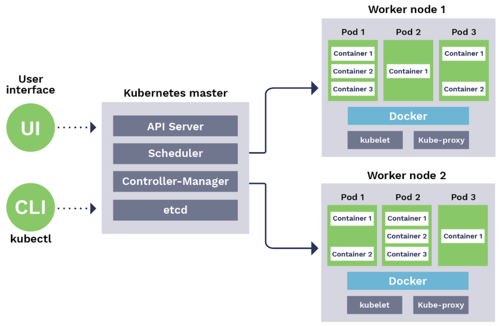

## Docker Tool End to End Documentation
* [Docker Installation](#docker-installation)
* [Docker File Instructions](#docker-file-instructions)
* [Docker CLI Commands](#docker-cli-commands) <br>
  [AmazonEC2ContainerRegistryFullAccess](https://console.aws.amazon.com/iam/home#policies/arn:aws:iam::aws:policy/AmazonEC2ContainerRegistryFullAccess) <br>

## Docker Installation
* File1
```

tool for deploying multi container docker applications

it contains information about containers

Docker Compose is a tool for running multi-container applications on Docker defined using the Compose file format. A Compose file is used to define how the one or more containers that make up your application are configured. Once you have a Compose file, you can create and start your application with a single command: docker-compose up.
docker-compose installation

-------------------------------

sudo curl -L https://github.com/docker/compose/releases/download/1.21.2/docker-compose-`uname -s`-`uname -m` -o /usr/local/bin/docker-compose

sudo chmod +x /usr/local/bin/docker-compose
           or
sudo apt-get install docker-compose

docker-compose --version


docker-compose.yaml
----------------------------

version: docker compose file format version 3 or 3.1

services: 

volumes:

networks:


sidercor container in kubernetes
docker-compose config
docker-compose up -d(detach)
```
* File2
```
Docker Installation
-----------------------
1.

curl -fsSL https://get.docker.com -o get-docker.sh
sh get-docker.sh

2.

apt install docker.io -y
systemctl restart docker
systemctl enable docker.service

docker info
docker version
docker --version
docker version --format '{{.Server.Version}}'
docker build -t(tag) imagename .
docker pull imagename

## To build Docker image using repository reference

docker build -t <hub-user>/<repo-name>:<imagetag> <pathof docker file>

docker build -t 'venkatondevops/nginxserver:1' .

docker push 
docker login -u <uname> -p <password> <url>
docker images
docker image ls
docker image inspect imagename
docker inspect imageid/imagename
docker history imageid/imagename ----  to see only layers
docker inspect containerid/containername
docker rmi -f(force) imageid/imagename
docker rmi -f(force) imageid/imagename imageid/imagename imageid/imagename - to delete all
docker rmi -f $(docker images -q)
docker images -q --  list all image ids
docker tag image -- to tag image to the repository
docker ps
docker container ls
docker container ls -a
docker ps -a all containers
docker ps -aq
docker container ls -aq
docker start containerid/name
docker restart containerid/name
docker stop containerid/name
docker kill containerid/name
docker pause containerid/name
docker unpause containerid/name
docker system prune -a  -- it will remove both unused and dangling images
docker images -f dangling=true -- list dangling images
docker rmi $(docker images -f dangling=true -q)
docker images --quiet --filter=dangling=true | xargs --no-run-if-empty docker rmi
docker image prune 
docker rm -f container-name/container-id
docker system prune ---- delte all stoped container, networks, dangling,
docker run -d --name contname -p <hostport>:<contport> imageid
dockertrustedregistry(Docker enterprise edition)
docker rm $(docker ps -aq --filter status="exited")
docker rm -f $(docker ps -aq )

what is dangling images in docker.

the image which doesnt have repository mapping or tagging
docker exec -it <container_name> bash


what is port publish or port mapping or port forwording
-------------------------------------------------------------
container name and host port should be unique in docker
you cannot update the port mapping once container is created


Docker Home directory or working directory
-----------------------------------------------
var/lib/docker

How can we move image from one server to another with out using repo
---------------------------------------------------------------------
docker save -o filename.tar imagename/imageid
then scp from source to destination

docker load -i filename.tar -  in desrination


difference between docker run and docker create
----------------------------------------------
docker create will only create the container but not run

docker run will create and start container


Docker container commands
---------------------------
docker run --name <containername> -p <hostport>:<containerport> imageName

docker create --name <containername> -p <hostport>:<containerport> imageName
docker start containername

Docker Credential Store
-----------------------------

$HOME/.docker/config.json

difference between docker kill and stop
------------------------------------
both are used to stop containers but stop will send 


docker kill will stop the main entrypoint process/program abruptly

docker stop will try to stop it gracefully by sending SIGTERM signal to a process to request its termination.


It is analogous to Pulling the Plug off Desktop and Shutting down the computer

Like pulling the Plug Off means hard power off, docker kill means s direct way to kill my_container, which does not attempt to shut down the process gracefully first.

Shutting down the computer means sending a signal to OS for shutting down all the processes where docker stop means sending SIGTERM signal to the running container to stop the processes gracefully.

Share


telling the docker dont use cache when building docker image
--------------------------------------------------------
docker build -t tagname --no-cache imagename


Docker Networking
----------------------------------
docker network ls
docker inspect containername/id
docker network create -d bridge flipkartnetwork
docker network create -d(driver) bridge flipkartnetwork
docker network inspect flipkartnetwork
docker run -d --name webserver --network flipkartnetwork -p 80:80  nginx
docker run -d --name mongo --network flipkartnetwork -p 3070:3070  mongo
docker network connect networkname containernameinothenetwork
docker network disconnect networkname containernameinothenetwork
docker network rm networkname

is it possible to do the volume mapping for a running container
--------------------------------------------------------------
port mapping and volume mapping can not be done for a running containers

Docker Volumes
--------------------------------------------------------
Bind Mounts - is nothing but a folder/file in the host system or docker server

docker volumes are suggestable when we are doing volume mapping rather than bindmount
Voulmes - these are persistent volumes
 Local Volumes
 Network Volumes

docker run -d --name contname -v <volumename/BindMountPath>:<containerpath> --network netwkname image

docker volume ls
docker volume create -d local <volumename>
docker run -d --name contname -v dockervolumename:<containerpath>:ro(read only) --network netwkname image
docker run -d --name contname -v dockervolumename:<containerpath>:rw(read write) --network netwkname image


Docker plugins
-------------------
rexray is the plugin for ebs

docker plugin ls
docker volume create -d rexray/ebs volumename

```
* file3
```
Troubleshooting
----------------

docker logs containerid/name
docker logs --tail 10 containerid/name

docker logs -f(floating) containerid/name

docker top containerid/name -- it will display process details

docker stats containerid/name -- it will display resource consumption details

to execute command in a container
------------------------------------

docker exec  containername/id ls

docker exec  containername/id pwd

docker exec -it containername/id /bin/bash

docker attach containername/id

docker cp containername/id:filepath localmachinepath

docker commit -- to get image from running container

what is the difference between copy and docker cp
-------------------------------------------------------


set cpu and ram limit for docker containers
------------------------------------------------


what is shell form and executable form in docker
--------------------------------------------------
When we try to execute an instruction using the shell form, normal shell processing takes place. It calls the command /bin/sh -c {command} behind the scenes.

When instruction is executed in exec form it calls executable directly, and shell processing does not happen


Shell form
<instruction> <command>
ENV name John Dow
ENTRYPOINT echo "Hello, $name"
when container runs as docker run -it <image> will produce output

Hello, John Dow

Exec form
This is the preferred form for CMD and ENTRYPOINT instructions.

<instruction> ["executable", "param1", "param2", ...]

ENV name John Dow
ENTRYPOINT ["/bin/echo", "Hello, $name"]
when container runs as docker run -it <image> will produce output

Hello, $name


what is the difference between CMD and ENTRYPOINT
------------------------------------------------
CMD Commands/Instructions can be overwritten while creating a container but ENTRYPOINT is opposite


can we have both CMD and ENTRYPOINT in docker file
---------------------------------------------------
yes we can have but CMD instruction will be passed as an arguments to ENTRYPOINT

eg.

CMD ls
ENTRYPOINT ["echo", "Hello"]

bin/echo Hello ls

```
* File 4
```
Docker file Instructions
--------------------------------
these are called docker instructions or docker file keywords
dockerfile instructions can be processed from top to bottom


FROM - Indicates the base image for our docker file

eg: tomcat, open-jdk, httpd

MAINTAINER - It will be used to desribe maintainer/author

eg: venkat@tr.com, kiran.b@bitsol.com

COPY - It will be used to copy files from host server to the image 

eg: COPY <srcfile> <dest>

ADD - add also can copy files to the image from hostserver and it will download files from the remote server. 

it will also copy tar file and will extract it.

eg. add <url> destination add <src> <dest>

RUN - instructions/commands will be executed while creating an image. we can have more than one RUN keywords in docker file

RUN instruction allows you to install your application and packages requited for it. 
It executes any commands on top of the current image and creates a new layer by committing the results. 
Often you will find multiple RUN instructions in a Dockerfile.

eg. RUN mkdir -p "$CATALINA_HOME"

CMD - it will execute commands while creating the container.

we will use it to start our application while creating the container

eg. sh catalina.sh run  or CMD ["java", "-jar", "springapplication.jar"]


ENTRYPOINT - entrypoint also used to execute commands


WORKDIR -  we can set working directory for an image/container. all subsequent instructions will be processed under working directory.


EXPOSE - which port is opened or being used in the image. <port>

ENV - env is used to set environment variables. these environment variables will be availble for image or container. 

eg. ENV JAVA_HOME /usr/bin/java  ENV CATALINA_HOME /usr/local/tomcat


USER - user is used to set user for the container or image. if not specified root as default user

eg. USER <username>

LABEL - we can add labels to the image

eg. LABEL <key> <Value>
refer arg name here
    LABEL branch $branchname
    LABEL environmetname $environment


ARG - branchname=dev

ARG - environment=prod

ARG - using arg we can define variables

while creating an image we can pass arguments as below

docker build -t <imagename> --buil-arg branchname=dev

VOLUME - volume keyword is used to mount a container folder with host folder.

```
## Docker File Instructions
```
  * Docker file Instructions
    --------------------------------
    these are called docker instructions or docker file keywords
    dockerfile instructions can be processed from top to bottom
    
    
    FROM - Indicates the base image for our docker file
    
    eg: tomcat, open-jdk, httpd
    
    MAINTAINER - It will be used to desribe maintainer/author
    
    eg: venkat@tr.com, kiran.b@bitsol.com
    
    COPY - It will be used to copy files from host server to the image 
    
    eg: COPY <srcfile> <dest>
    
    ADD - add also can copy files to the image from hostserver and it will download files from the remote     server. 
    
    it will also copy tar file and will extract it.
    
    eg. add <url> destination add <src> <dest>
    
    RUN - instructions/commands will be executed while creating an image. we can have more than one RUN     keywords in docker file
    
    RUN instruction allows you to install your application and packages requited for it. 
    It executes any commands on top of the current image and creates a new layer by committing the     results. 
    Often you will find multiple RUN instructions in a Dockerfile.
    
    eg. RUN mkdir -p "$CATALINA_HOME"
    
    CMD - it will execute commands while creating the container.
    
    we will use it to start our application while creating the container
    
    eg. sh catalina.sh run  or CMD ["java", "-jar", "springapplication.jar"]
    
    
    ENTRYPOINT - entrypoint also used to execute commands
    
    
    WORKDIR -  we can set working directory for an image/container. all subsequent instructions will be     processed under working directory.
    
    
    EXPOSE - which port is opened or being used in the image. <port>
    
    ENV - env is used to set environment variables. these environment variables will be availble for     image or container. 
    
    eg. ENV JAVA_HOME /usr/bin/java  ENV CATALINA_HOME /usr/local/tomcat
    
    
    USER - user is used to set user for the container or image. if not specified root as default user
    
    eg. USER <username>
    
    LABEL - we can add labels to the image
    
    eg. LABEL <key> <Value>
    refer arg name here
        LABEL branch $branchname
        LABEL environmetname $environment
    
    
    ARG - branchname=dev
    
    ARG - environment=prod
    
    ARG - using arg we can define variables
    
    while creating an image we can pass arguments as below
    
    docker build -t <imagename> --buil-arg branchname=dev
    
    VOLUME - volume keyword is used to mount a container folder with host folder.
```
	
## Docker CLI Commands
To run this project, install it locally using npm:

```shell script
  *. Build
    docker build -t <hub-user>/<repo-name>:<imagetag> <pathof docker file>
    docker build -t 'venkatondevops/nginxserver:1' .
    docker push 
    docker login -u <uname> -p <password> <url>
    docker images
    docker image ls
    docker image inspect imagename
    docker inspect imageid/imagename
    docker history imageid/imagename ----  to see only layers
    docker inspect containerid/containername
    docker rmi -f(force) imageid/imagename
    docker rmi -f(force) imageid/imagename imageid/imagename imageid/imagename - to delete all
    docker rmi -f $(docker images -q)
    docker images -q --  list all image ids
    docker tag image -- to tag image to the repository
    docker ps
    docker container ls
    docker container ls -a
    docker ps -a all containers
    docker ps -aq
    docker container ls -aq
    docker start containerid/name
    docker restart containerid/name
    docker stop containerid/name
    docker kill containerid/name
    docker pause containerid/name
    docker unpause containerid/name
    docker system prune -a  -- it will remove both unused and dangling images
    docker images -f dangling=true -- list dangling images
    docker rmi $(docker images -f dangling=true -q)
    docker images --quiet --filter=dangling=true | xargs --no-run-if-empty docker rmi
    docker image prune 
    docker rm -f container-name/container-id
    docker system prune ---- delte all stoped container, networks, dangling,
    docker run -d --name contname -p <hostport>:<contport> imageid
    dockertrustedregistry(Docker enterprise edition)
    docker rm $(docker ps -aq --filter status="exited")
    docker rm -f $(docker ps -aq )

```
  

